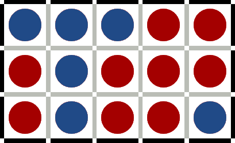
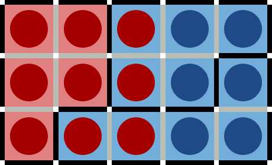
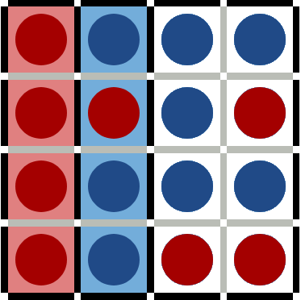
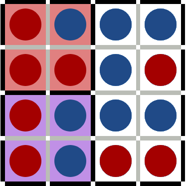

# 04/25 Worksheet: Dynamic Programming
## Initial due date: 04/29 5pm
### Accepted as on time until: 05/01 11:59pm
### Note that the deadline to turn in *with opportunity for revision* is Friday, 04/29
Collaborators:

Answer the below questions, and make sure that you commit to your own branch.
When done, run your code through [the autograder](http://autograder.oxy.edu/) and make a pull request on github. Don't forget to tag @irabkina.
Respond to my comments by making new commits to the same branch.

## Review

1. In your own words, define dynamic programming. What is its distinguishing feature?
2. How does dynamic programming relate to recursion?
3. A popular example of dynamic programming is calculating the nth Fibonacci number (it is used both in your textbook and in the video). What is the formula for finding the nth Fibonacci number?
4. What inefficiency in the recursive Fibonacci algorithm does dynamic programming solve? How?
5. What is the worst case computational complexity of recursive Fibonacci? What about the dynamic programming version?
6. In your own words, what is gerrymandering?
7. Gerrymander the following map into three districts so that blue controls the majority of districts.
    
   
8. Why might gerrymandering be considered undemocratic?
9. Considering that gerrymandering [has been around for over two centuries](https://en.wikipedia.org/wiki/Gerrymandering#Etymology), what makes *computational* gerrymandering particularly dangerous?
10. To keep the vocabulary consistent, we will pretend we are drawing districts in a dense urban area, and so will consider grouping *city blocks* into *districts*. Since districts must be contiguous (i.e. there cannot be a district where the blocks are disconnected), what data structure might we use to represent the geography of different blocks and whether they touch each other?

## Exploration
1. In the next two questions, we are going to go through the solution to a dynamic programming interview question. First, we will walk through the recursive solution.
You will write your code in `StairHop.java`. Please submit that file to the autograder _and_ include it in your github submission.    

   *The problem: A child is running up a staircase with n steps, and can hop either 1, 2, or 3 steps at a time. Implement a method to count how many unique ways the child can hop up the stairs.*

   a. What is/are the base case(s) of this problem? What about the recursive case(s)?  
   b. What is the "smaller subproblem"?  
   c. What is the relationship between the solution to the smaller subproblem and the solution to the whole problem?  
   d. Write the recursive solution to this question in the `stairhop_recur()` method of `StairHop.java`.  
   e. What is the worst case computational complexity of your recursive solution?
   
2. Now, we will write the dynamic programming solution to the problem from E1.    
   a. What computation is repeated in your recursive `stairhop` solution?  
   b. The wrapper method for `stairhop_dyn()` is done for you. What role will the `memo` array play in the recursive part of the dynamic programming solution? That is, what will you store in there?
    (Note: "memo" refers to memoization, which is a variation of dynamic programming. The distinction is small enough that we will ignore it in this class.)  
   c. Fill in the recursive `stairhop_dyn()` method. (Hint: How do you know whether you've already calculated the number of solutions for a given number of steps?)  
   d. What is the worst case computational complexity of your dynamic programming solution?
   
3. Next, we will explore how to convert gerrymandering into a dynamic programming problem. We will assume that each block has the same population, and that the total number of blocks is divisible by the number of districts required. This means that each district will have the same number of blocks. 
   A given gerrymandering problem will divide *n* blocks into *k* districts of *(n/k)* blocks. Playing around with [this interactive demo](http://appoxy.herokuapp.com/dyna_prog/#rows=4&cols=4&demographics=RBBRRRBRRBBBRRRR) might help you tackle the problems below.    
   a. Gerrymandering is really about the different ways you can *partition* the map into *k* non-overlapping districts. For the map below, draw all the ways you can partition it into 3 districts of 3 blocks each. (Hint: there should be 10 partitions total.)

      
b. What is the base case for gerrymandering as a recursive problem? That is, what is the easiest version of gerrymandering that you immediately know the answer to?  
   c. What is the *smaller subproblem* of gerrymandering?  
   d. What is the relationship between the solution to the smaller subproblems and the solution to the whole problem?  
   e. What is being cached/memoized in the dynamic programming approach to gerrymandering? Give a specific example (i.e., draw two maps) of when the cached/memoized result will reduce the time complexity of gerrymandering.

## Challenge

In this section, we will use gerrymandering to explain some more abstract ideas about dynamic programming.

1. To create the smaller subproblems, we must first be able to enumerate all possible first districts. What existing algorithm that you've already learned might help us do this?
2. Dynamic programming is sometimes said to be helpful on problems with *optimal and overlapping substructure*. Think back to when we asked you to compare dynamic programming with recursion (R2), and explain what the "overlapping substructure" part of that definition means.
3. The "optimal" part of that definition is a little trickier to describe. One way of understanding it is that given a solution to the larger problem, each sub-part of it would itself be the solution to a smaller subproblem. Using the example map below, explain why this is true for gerrymandering as presented in this worksheet.
    
    
4. There are various metrics that we might optimize for to eliminate gerrymandering, [such as high compactness, small efficiency gap, and others](https://projects.fivethirtyeight.com/redistricting-maps/). Imagine that we want to gerrymander the map so that there are equal number of red and blue districts. (Note that this is *not* the same thing as maximizing the number of districts with equal red/blue blocks.)
    
    a. For the scenario below, what districts should be drawn for the remaining ungerrymandered right side of the map?

    
    
    b. For the scenario below, what districts should be drawn for the remaining ungerrymandered right side of the map?

    

    c. Notice that the previous two scenarios are the same map, just with different existing districts. Given your answers to the two scenarios, explain why we *can't* use the same dynamic programming approach for this optimization.

    d. Finally, relate this back to the "optimality" criteria from above, and explain how if the solution of the smaller problem changes based on context (i.e., what the other parts of the larger problem are), the problem could not have "optimal substructure".